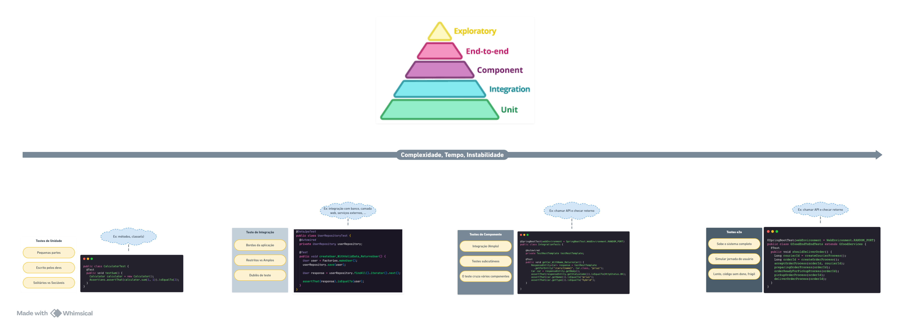

<h1 align="center">
  ✨ StarWars Planet API 🚀
</h1>

<p align="center">
  <a href="#-Projeto">Projeto</a>&nbsp;&nbsp;&nbsp;|&nbsp;&nbsp;&nbsp;
  <a href="#-Diagrama">Diagrama</a>&nbsp;&nbsp;&nbsp;|&nbsp;&nbsp;&nbsp;
  <a href="#-Tipos-de-Testes">Tipos de Testes</a>&nbsp;&nbsp;&nbsp;|&nbsp;&nbsp;&nbsp;
  <a href="#-Construir">Construir</a>&nbsp;&nbsp;&nbsp;|&nbsp;&nbsp;&nbsp;
  <a href="#-Executar">Executar</a>&nbsp;&nbsp;&nbsp;|&nbsp;&nbsp;&nbsp;
  <a href="#-Tecnologias">Tecnologias</a>
</p>

<p align="center">
  <a href="https://opensource.org/licenses/MIT">
    
  </a>
  <a href="https://www.udemy.com/course/testes-automatizados-na-pratica-com-spring-boot/?referralCode=7F6C5AA14AE558497FE0">
    
  </a>
</p>


## 💻 Projeto

SW-PLANET-API é um serviço web que provê dados sobre a franquia de Star Wars, mais especificamente sobre os planetas que
aparecem nos filmes. Esse projeto foi elaborado durante o curso [Testes Automatizados na Prática com Spring Boot](https://www.udemy.com/course/testes-automatizados-na-pratica-com-spring-boot/?referralCode=7F6C5AA14AE558497FE0), 
em que o foco foi a criação de testes automatizados.</br>

### 📜 Estrutura do Projeto

Algumas classes foram criadas para separar adequadamente as suas funções e também facilitar a leitura da estrutura:

## Classes *`DOMAIN`*


### 1 - **Planet**:

#### Descrição:
A classe `Planet` representa um planeta no universo de Star Wars. Ela é responsável por armazenar informações essenciais
sobre um planeta, incluindo seu nome, clima e terreno. Esta classe está mapeada para a tabela `planets` no banco de dados e utiliza a especificação JPA para gerenciar a persistência dos dados.

#### Atributos
- `id` (`Long`): Identificador único do planeta, gerado automaticamente pelo banco de dados.
- `name` (`String`): Nome do planeta. Esse campo é obrigatório e deve ser único.
- `climate` (`String`): Descrição do clima do planeta. Campo obrigatório.
- `terrain` (`String`): Descrição do terreno do planeta. Campo obrigatório.

#### Construtores
- **Construtor Padrão**: Utilizado para criar uma instância vazia de `Planet`.
- **Construtor com Clima e Terreno**: Permite criar uma instância de `Planet` especificando apenas o clima e o terreno.
- **Construtor com Nome, Clima e Terreno**: Permite criar uma instância de `Planet` especificando o nome, o clima e o 
terreno.
- **Construtor com ID, Nome, Clima e Terreno**: Utilizado para criar uma instância de `Planet` com todos os atributos 
definidos, incluindo o ID.

#### Métodos
- `getId() / setId(Long id)`: Obtém/Define o identificador do planeta.
- `getName() / setName(String name)`: Obtém/Define o nome do planeta.
- `getClimate() / setClimate(String climate)`: Obtém/Define o clima do planeta.
- `getTerrain() / setTerrain(String terrain)`: Obtém/Define o terreno do planeta.
- `equals(Object obj)`: Sobrescrito para comparar dois objetos `Planet` com base em todos os atributos.
- `toString()`: Gera uma representação textual do objeto `Planet`.

#### Anotações
- `@Entity`: Indica que a classe é uma entidade JPA que será mapeada para uma tabela no banco de dados.
- `@Table(name = "planets")`: Especifica o nome da tabela no banco de dados.
- `@Id`: Denota o campo `id` como a chave primária.
- `@GeneratedValue(strategy = GenerationType.IDENTITY)`: Define a estratégia de geração do identificador.
- `@NotEmpty`: Valida que os campos `name`, `climate`, e `terrain` não podem ser nulos ou vazios.
- `@Column`: Configura os detalhes das colunas no banco de dados, como `nullable = false` e `unique = true` para o campo `name`.
- `@ExcludeFromJacocoGeneratedReport`: Exclui o método `toString()` da cobertura de testes gerada pelo Jacoco.

#### Testes Unitários
A classe `Planet` pode ser testada usando as seguintes tecnologias:
- **Spring Boot Test**: Para o contexto geral de teste.
- **JUnit 5**: Para criação e execução dos testes.
- **Mockito**: Para criação de mocks e simulação de dependências.
- **AssertJ e Hamcrest**: Para realizar asserções fluentes e legíveis.
- **JsonPath**: Para validação de respostas JSON.
- **Jacoco**: Para gerar relatórios de cobertura de testes.
- **Pitest**: Para realizar testes mutantes e garantir a eficácia dos testes unitários.


### 2 - **PlanetRepository**:

#### Descrição
A interface `PlanetRepository` é responsável pela interação com o banco de dados para a entidade `Planet`. 
Ela estende `CrudRepository` e `QueryByExampleExecutor` do Spring Data JPA, fornecendo métodos para operações básicas de
CRUD e consultas personalizadas baseadas em exemplos.

#### Métodos

- `Optional<Planet> findByName(String name)`: Busca um planeta pelo nome. Retorna um `Optional` contendo o planeta 
encontrado ou vazio, caso não exista.

- `<S extends Planet> List<S> findAll(Example<S> example)`: Sobrescreve o método `findAll` para permitir a busca de 
todos os planetas que correspondem ao exemplo fornecido.

#### Extensões

- **CrudRepository<Planet, Long>**: Fornece métodos para operações CRUD (Create, Read, Update, Delete) básicos.
    - `save(S entity)`: Salva uma entidade `Planet`.
    - `findById(ID id)`: Busca um planeta pelo seu ID.
    - `deleteById(ID id)`: Remove um planeta pelo seu ID.
    - `findAll()`: Retorna todos os planetas.

- **QueryByExampleExecutor<Planet>**: Permite consultas dinâmicas baseadas em exemplos. Um exemplo é um objeto 
parcialmente preenchido, onde os campos preenchidos servem como critérios para a consulta.

#### Anotações

- `@Repository`: (implicitamente adicionada pelo Spring Data JPA) Marca a interface como um repositório Spring Data, 
que será gerenciado pelo container Spring.

#### Testes Unitários
A interface `PlanetRepository` pode ser testada utilizando:
- **Spring Boot Test**: Para testar a integração com o contexto de persistência.
- **JUnit 5**: Para criação e execução dos testes.
- **Mockito**: Para simulação de repositórios durante os testes.
- **AssertJ e Hamcrest**: Para realizar asserções fluentes e legíveis.
- **Jacoco**: Para gerar relatórios de cobertura de testes.
- **Pitest**: Para garantir a eficácia dos testes de repositório.


### 3 - **PlanetService**:

#### Descrição
A classe `PlanetService` é responsável por fornecer a lógica de negócios relacionada aos planetas na aplicação. 
Ela utiliza o repositório `PlanetRepository` para realizar operações de criação, busca, listagem e remoção de planetas.

#### Atributos
- `planetRepository` (`PlanetRepository`): Dependência injetada usada para interagir com o banco de dados.

#### Construtores
- **PlanetService(PlanetRepository planetRepository)**: Construtor que injeta o repositório de planetas, necessário para
realizar as operações de CRUD.

#### Métodos

- `Planet create(Planet planet)`: Cria e salva um novo planeta no banco de dados.

- `Optional<Planet> get(Long id)`: Busca um planeta pelo seu ID. Retorna um `Optional` contendo o planeta encontrado ou 
vazio, caso não exista.

- `Optional<Planet> getByName(String name)`: Busca um planeta pelo seu nome. Retorna um `Optional` contendo o planeta 
encontrado ou vazio, caso não exista.

- `List<Planet> list(String terrain, String climate)`: Lista todos os planetas que correspondem ao terreno e clima 
especificados. Utiliza a funcionalidade de consulta por exemplo (Query by Example) para construir a consulta.

- `void remove(Long id)`: Remove um planeta do banco de dados pelo seu ID.

#### Anotações

- `@Service`: Indica que a classe é um componente de serviço do Spring, que contém a lógica de negócios e pode ser 
injetado em outros componentes.

#### Testes Unitários
A classe `PlanetService` pode ser testada utilizando:
- **Spring Boot Test**: Para testar a integração com o contexto da aplicação.
- **JUnit 5**: Para criação e execução dos testes.
- **Mockito**: Para simular o comportamento do repositório durante os testes de unidade.
- **AssertJ e Hamcrest**: Para realizar asserções fluentes e legíveis.
- **Jacoco**: Para gerar relatórios de cobertura de testes.
- **Pitest**: Para garantir a eficácia dos testes unitários, especialmente para a lógica de negócios.


### 4 - **QueryBuilder**:

#### Descrição
A classe `QueryBuilder` é uma classe utilitária que fornece um método para criar consultas dinâmicas utilizando o 
mecanismo de `Query by Example` do Spring Data JPA. Ela é usada para construir consultas baseadas em exemplos de entidades `Planet`, permitindo a busca de planetas no banco de dados com base em critérios parciais.

#### Métodos

- `static Example<Planet> makeQuery(Planet planet)`: Este método cria uma instância de `Example<Planet>` usando o objeto
`planet` fornecido. Ele utiliza um `ExampleMatcher` que configura a consulta para:
    - **matchingAll()**: Correspondência de todos os campos preenchidos.
    - **withIgnoreCase()**: Ignorar a sensibilidade a maiúsculas e minúsculas.
    - **withIgnoreNullValues()**: Ignorar campos nulos na entidade `planet` ao criar a consulta.

#### Anotações

- **Classe utilitária**: `QueryBuilder` é uma classe utilitária, ou seja, ela não deve ser instanciada. 
Para garantir isso, o construtor padrão é privado.

#### Uso
A classe `QueryBuilder` é tipicamente utilizada em serviços que precisam construir consultas dinâmicas baseadas em 
atributos de um planeta. Por exemplo, na classe `PlanetService`, o método `list` utiliza `QueryBuilder.makeQuery()` 
para construir a consulta que será passada ao repositório.


#### Exemplo de Uso
```java
Planet planet = new Planet("desert", "arid");
Example<Planet> query = QueryBuilder.makeQuery(planet);
List<Planet> results = planetRepository.findAll(query);
```

#### Testes Unitários
A classe `QueryBuilder` pode ser testada utilizando:

- **JUnit 5**: Para verificar a correta construção das consultas.
- **AssertJ e Hamcrest**: Para asserções fluentes e legíveis sobre os exemplos criados.

#### Considerações
- Como a classe `QueryBuilder` é utilitária e possui apenas métodos estáticos, não é necessário instanciá-la. O design da classe segue o princípio de ocultar o construtor para impedir sua instância.
- O `ExampleMatcher` configurado garante que as consultas sejam flexíveis, ignorando a capitalização e valores nulos, o que facilita a busca de planetas com base em diferentes critérios.


## Classes *`PROJETO`*

### 5 - 

## 📜 Diagrama


## 🧪 Tipos de Testes

### 🧟 Testes Mutantes
**Pergunta:** O que são os testes mutantes?

**Resposta:** A ideia é criar mutações no código, para avaliar e verificar se o código quebra. Se o código for alterado e o teste não quebrar, então ele está errado, pois o teste deve sim quebrar.

Para avaliar isso, podemos usar o teste mutante. Com ele podemos realizar uma execução e verificar se o teste detecta essa mutação, ou seja, se quando eu mudo o código, o teste quebra e se ele realmente está “testando” algo.

É um teste mais lento e não deve rodar junto ao teste de integração, pois o teste mutante usa a dependência do Pitest, que deve ser configurado no pom.xml especificando versão, apontando os parâmetros e classes.


## ✅ Construir

O projeto requer um banco de dados MySQL, então é necessário criar uma base de dados com os seguintes comandos:
```sh
$ sudo mysql

CREATE USER 'user'@'%' IDENTIFIED BY '123456';
GRANT ALL PRIVILEGES ON *.* TO 'user'@'%' WITH GRANT OPTION;

exit

$ mysql -u user -p

CREATE DATABASE starwars;

exit
```
Durante os testes, as tabelas de banco já serão criadas automaticamente no banco de dados.


## 🚀 Executar

1 - Para construir e testar, execute o comando:
```sh
$ ./mvnw clean verify
```

2 - Para executar o Teste Mutante, foi necessário executar o comando abaixo:
```
C:\Star-Wars-Planets-API\Testes\sw-planet-api> ./mvnw test-compile org.pitest:pitest-maven:mutationCoverage
```


## 🦾 Tecnologias

- [Mysql](https://dev.mysql.com/downloads/mysql/)
- [Java](https://www.oracle.com/java/technologies/downloads/)
- [Maven](https://maven.apache.org/download.cgi)
- [Spring Boot](https://spring.io/projects/spring-boot)
- [Spring Testing](https://docs.spring.io/spring-framework/docs/current/reference/html/testing.html#testing-introduction)
- [JUnit 5](https://junit.org/junit5/docs/current/user-guide/)
- [Mockito](https://site.mockito.org)
- [AssertJ](https://github.com/assertj/assertj)
- [Hamcrest](http://hamcrest.org/JavaHamcrest/)
- [Jacoco](https://github.com/jacoco/jacoco)
- [Pitest](https://pitest.org)

